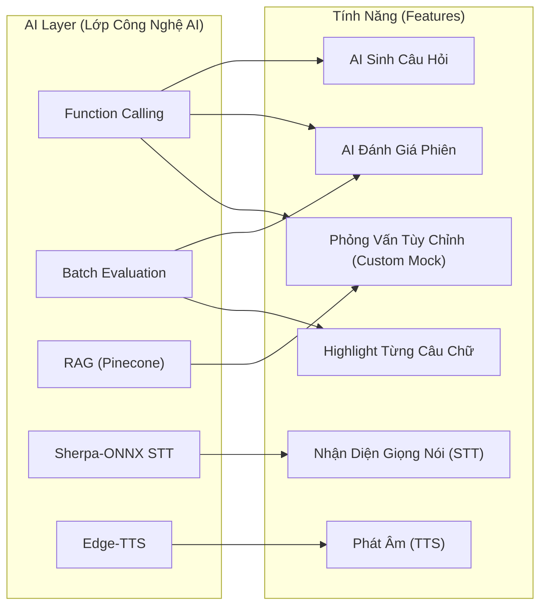

# MockITV — Danh Sách Tính Năng MVP

## 1. Tổng Quan Tính Năng (Feature Overview)

MockITV MVP bao gồm **24 tính năng** đã triển khai hoàn chỉnh, được chia thành 6 nhóm chức năng cốt lõi.

| Nhóm Tính Năng | Số lượng | Trạng thái |
|---|---|---|
| Phỏng Vấn Cốt Lõi (Core Interview) | 5 | ✅ Đã hoàn thành |
| Đánh Giá AI (AI Evaluation) | 4 | ✅ Đã hoàn thành |
| Phỏng Vấn Bằng Giọng Nói (Voice Interview) | 4 | ✅ Đã hoàn thành |
| Cá Nhân Hóa & RAG | 3 | ✅ Đã hoàn thành |
| Trải Nghiệm & Giao Diện (UX & Design) | 5 | ✅ Đã hoàn thành |
| Hạ Tầng (Infrastructure) | 3 | ✅ Đã hoàn thành |

---

## 2. Các Tính Năng Đã Triển Khai (MVP Features)

### 2.1. Phỏng Vấn Cốt Lõi (Core Interview)

| # | Tính năng (Feature) | Mô tả (Description) | Tệp Nguồn (Source Files) | Trạng thái |
|---|---|---|---|---|
| F-01 | **Danh Sách Công Việc (Job Listing)** | Giao diện dạng lưới (Grid) hiển thị các vị trí mock interview kèm avatar, tech stack và cấp độ. | `frontend/app/mocks/page.tsx`, `backend/routes/jobs.py` | ✅ |
| F-02 | **Bộ Lọc Cấp Độ & Danh Mục (Category & Level Filter)** | Bộ lọc theo 14 danh mục (Backend, Frontend, AI/ML...) và 9 cấp độ kinh nghiệm (Intern → Manager). | `frontend/app/mocks/page.tsx` | ✅ |
| F-03 | **AI Sinh Câu Hỏi (AI Question Generation)** | LLM tự động sinh bộ câu hỏi phỏng vấn (kỹ thuật, hành vi, giải quyết vấn đề) thông qua Function Calling. | `backend/ai/service.py → generate_questions()` | ✅ |
| F-04 | **Giao Diện Phỏng Vấn (Live Interview UI)** | Giao diện tương tác trả lời từng câu hỏi với bộ đếm ký tự, đồng hồ đếm ngược và thanh tiến độ. | `frontend/app/interview/[id]/` | ✅ |
| F-05 | **Nộp Câu Trả Lời (Answer Submission)** | Gửi từng câu trả lời, lưu trữ vào Database và tự động chuyển sang câu tiếp theo. | `backend/routes/sessions.py → submit_answer()` | ✅ |

### 2.2. Đánh Giá AI (AI Evaluation)

| # | Tính năng (Feature) | Mô tả (Description) | Tệp Nguồn (Source Files) | Trạng thái |
|---|---|---|---|---|
| F-06 | **Đánh Giá Hàng Loạt (Batch Evaluation)** | Sử dụng 1 API call duy nhất để đánh giá toàn bộ phiên phỏng vấn (Giúp tiết kiệm 80% chi phí token). | `backend/ai/service.py → batch_evaluate_session()` | ✅ |
| F-07 | **Làm Nổi Bật Từng Từ (Verbatim Highlighting)** | Highlight từng cụm từ trong câu trả lời (xanh/vàng/đỏ) kèm theo tooltip giải thích chi tiết lỗi sai và cách sửa. | `backend/ai/validators.py`, `frontend/app/history/page.tsx` | ✅ |
| F-08 | **Chấm Điểm Đa Chiều (Multi-dimensional Scoring)** | Chấm điểm trên 4 tiêu chí: Tổng quan, Kỹ thuật, Giao tiếp, Giải quyết vấn đề bằng biểu đồ SVG (RadialProgress). | `backend/ai/schemas.py → OverallEvaluation` | ✅ |
| F-09 | **Phản Hồi Toàn Diện (Comprehensive Feedback)** | Chỉ ra chi tiết Điểm mạnh, Điểm yếu, Khuyến nghị, Các chủ đề cần học và Tài nguyên học tập. | `backend/models.py → MockSession.to_dict()` | ✅ |

### 2.3. Phỏng Vấn Bằng Giọng Nói (Voice Interview)

| # | Tính năng (Feature) | Mô tả (Description) | Tệp Nguồn (Source Files) | Trạng thái |
|---|---|---|---|---|
| F-10 | **Truyền Phát Chuyển Ngữ (Streaming STT)** | Sử dụng WebSocket để nhận diện giọng nói theo thời gian thực (Sherpa-ONNX, chạy offline, đa ngôn ngữ). | `backend/routes/voice.py → ws_stt()` | ✅ |
| F-11 | **Phát Âm Tiếng Việt (TTS Vietnamese)** | Đọc văn bản bằng giọng tiếng Việt tự nhiên (Sử dụng Edge-TTS, model vi-VN-NamMinhNeural). | `backend/ai/service.py → text_to_speech()` | ✅ |
| F-12 | **Hội Thoại AI (Conversational AI)** | AI đóng vai trò phỏng vấn viên, phản hồi và đặt câu hỏi đào sâu tiếp theo (Dựa trên LangChain messages). | `backend/ai/service.py → voice_interview_respond()` | ✅ |
| F-13 | **Trả Lời Luồng (SSE Streaming Response)** | Trả lời luồng từ AI theo từng câu (sentence-by-sentence) giúp giảm thiểu độ trễ khi phát giọng nói. | `backend/ai/service.py → voice_interview_respond_stream()` | ✅ |

### 2.4. Cá Nhân Hóa & RAG (RAG & Personalization)

| # | Tính năng (Feature) | Mô tả (Description) | Tệp Nguồn (Source Files) | Trạng thái |
|---|---|---|---|---|
| F-14 | **Tải Lên & Bóc Tách CV (CV Upload & Parse)** | Tải lên file PDF/DOCX, trích xuất văn bản qua pypdf/python-docx (Giới hạn tối đa 5MB). | `backend/routes/sessions.py → parse_cv_file()` | ✅ |
| F-15 | **Cá Nhân Hóa Qua CV (CV-based Question Personalization)** | AI phân tích CV → xác định các kỹ năng hiện có, kỹ năng còn thiếu → sinh câu hỏi phỏng vấn sát với kinh nghiệm ứng viên. | `backend/ai/service.py → analyze_cv()` | ✅ |
| F-16 | **Phỏng Vấn Tùy Chỉnh Qua Pinecone RAG (Custom Mock)** | Tải CV/JD → cắt văn bản (chunk) → nhúng (embed) → đưa vào Pinecone → truy xuất ngữ cảnh (retrieve) → sinh câu hỏi từ RAG. | `backend/ai/pinecone_service.py`, `backend/routes/sessions.py → create_custom_mock_session()` | ✅ |

### 2.5. Trải Nghiệm & Giao Diện (UX & Design)

| # | Tính năng (Feature) | Mô tả (Description) | Tệp Nguồn (Source Files) | Trạng thái |
|---|---|---|---|---|
| F-17 | **Giao Diện Tối/Sáng (Dark/Light Mode)** | Chuyển đổi theme (sử dụng next-themes, dựa trên class, mặc định là Dark mode). | `frontend/components/ThemeProvider.tsx` | ✅ |
| F-18 | **Đa Ngôn Ngữ (Bilingual i18n VI/EN)** | Chuyển đổi ngôn ngữ tĩnh linh hoạt theo ngữ cảnh. | `frontend/components/LanguageProvider.tsx` | ✅ |
| F-19 | **Thiết Kế Đáp Ứng (Responsive Design)** | Tiếp cận Mobile-first, tương thích tốt trên các màn hình sm/md/lg. | `frontend/app/*.tsx` (Tailwind classes) | ✅ |
| F-20 | **Hiệu Ứng Chuyển Động (Framer Motion Animations)** | Chuyển trang mượt mà, hiệu ứng khi di chuột (hover), hiển thị danh sách dạng bậc thang (staggered). | `frontend/app/*.tsx` (motion.div) | ✅ |
| F-21 | **Giao Diện Kính Mờ (Glassmorphism UI)** | Hiệu ứng làm mờ nền (backdrop blur), nút bấm gradient, và hiệu ứng đổ bóng. | `frontend/app/globals.css` | ✅ |

### 2.6. Hạ Tầng (Infrastructure)

| # | Tính năng (Feature) | Mô tả (Description) | Tệp Nguồn (Source Files) | Trạng thái |
|---|---|---|---|---|
| F-22 | **Khởi Động Nhanh (Zero-Config Setup)** | Cấu hình tự động khởi chạy chỉ với 1 thao tác (start.sh / start.bat). | `start.sh`, `start.bat` | ✅ |
| F-23 | **Tự Động Tạo Dữ Liệu (Auto-Seed Database)** | SQLite tự động khởi tạo bảng + mớm sẵn 7 công việc, 3 phiên phỏng vấn mẫu khi khởi động. | `backend/seed_data.py` | ✅ |
| F-24 | **Kiểm Thử Tích Hợp (Integration Test Suite)** | 7 kịch bản kiểm thử API tự động chạy trên Database SQLite độc lập. | `backend/test_main.py` | ✅ |

---

## 3. Bản Đồ Tính Năng Theo Công Nghệ (Feature-to-Technology Mapping)

---

## 4. Ma Trận Độ Ưu Tiên Của Tính Năng (Feature Priority Matrix)

| Mức Độ Ưu Tiên | Các Tính Năng |
|---|---|
| **P0 — Nghiêm Trọng (Critical)** | F-01 Danh Sách Công Việc, F-03 AI Sinh Câu Hỏi, F-05 Nộp Câu Trả Lời, F-06 AI Đánh Giá Hàng Loạt, F-07 Làm Nổi Bật Từng Câu Chữ |
| **P1 — Quan Trọng (Important)** | F-02 Bộ Lọc, F-04 Giao Diện Phỏng Vấn, F-08 Chấm Điểm Đa Chiều, F-09 Phản Hồi Toàn Diện, Lịch Sử Phỏng Vấn |
| **P2 — Mở Rộng (Enhanced)** | F-10 STT, F-11 TTS, F-12 Hội Thoại AI, F-14 Tải Lên CV, F-16 Phỏng Vấn Tùy Chỉnh RAG |
| **P3 — Hoàn Thiện (Polish)** | F-17 Giao Diện Tối/Sáng, F-18 Đa Ngôn Ngữ, F-19 Thiết Kế Đáp Ứng, F-20 Hiệu Ứng, F-21 Glassmorphism |

---

## 5. Các Tính Năng Dành Cho Tương Lai (Post-MVP)

| Tính Năng (Feature) | Mô tả (Description) | Độ Ưu Tiên |
|---|---|---|
| Phân Tích Khuôn Mặt (Face Analysis) | Tích hợp Camera → nhận diện sự tự tin, tương tác bằng mắt. | Trung Bình |
| Lộ Trình Học Tập (Learning Paths) | Theo dõi tiến độ qua thời gian → đề xuất cải thiện điểm yếu. | Trung Bình |
| Ứng Dụng Di Động (Mobile App) | Phát triển phiên bản React Native. | Thấp |
| Tính Năng Nhóm (Team Features) | Các nhóm luyện phỏng vấn, bảng xếp hạng. | Thấp |
| Xuất PDF (PDF Export) | Tạo báo cáo PDF cho kết quả phỏng vấn. | Trung Bình |
| Xác Thực (Authentication) | Quản lý tài khoản người dùng, tích hợp OAuth. | Trung Bình |
| Quy Trình CI/CD (CI/CD Pipeline) | Tự động hóa kiểm thử và triển khai hệ thống. | Trung Bình |
