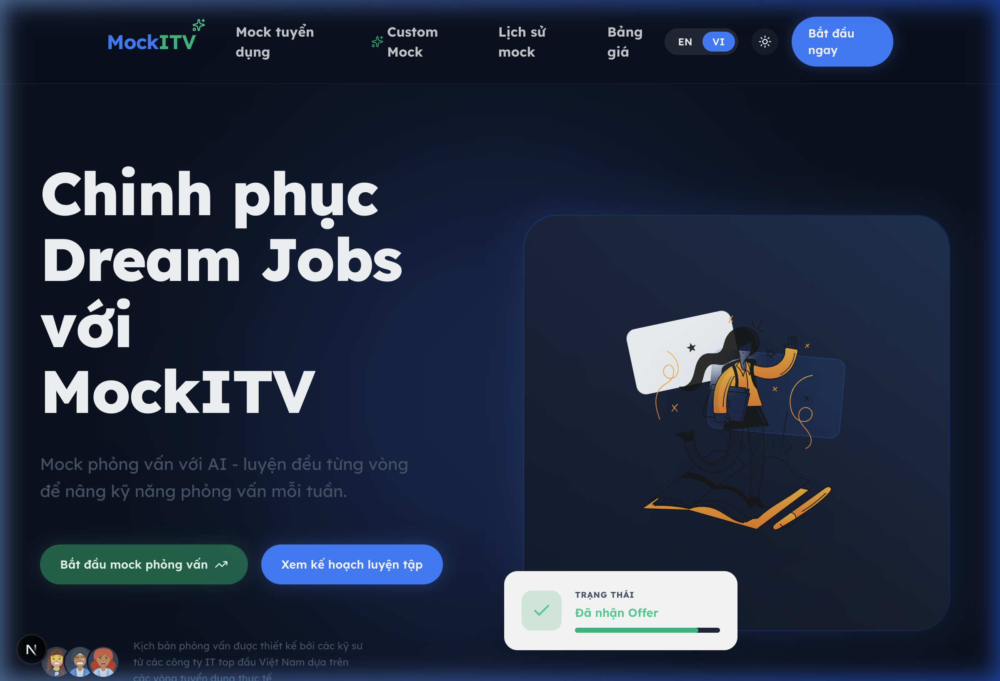
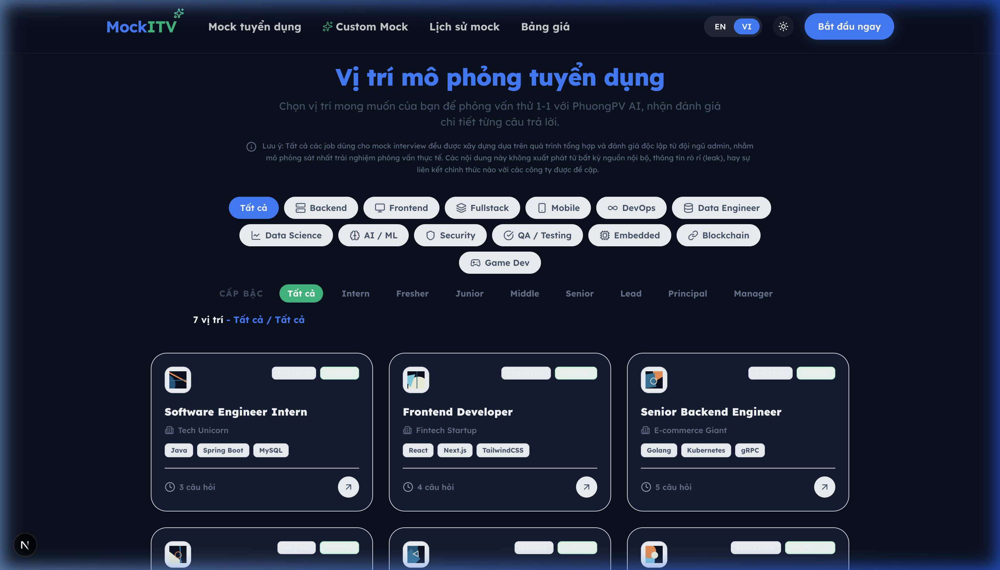
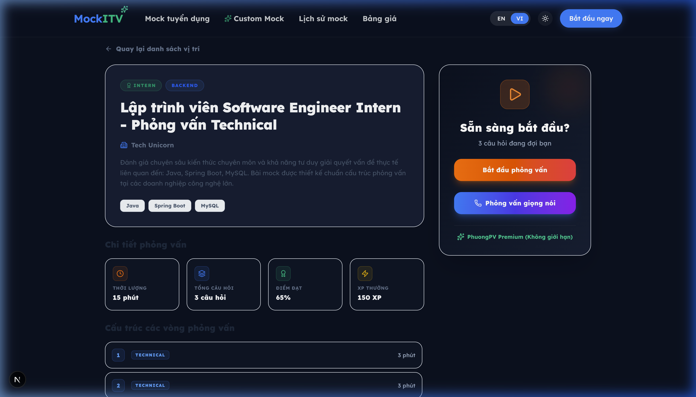
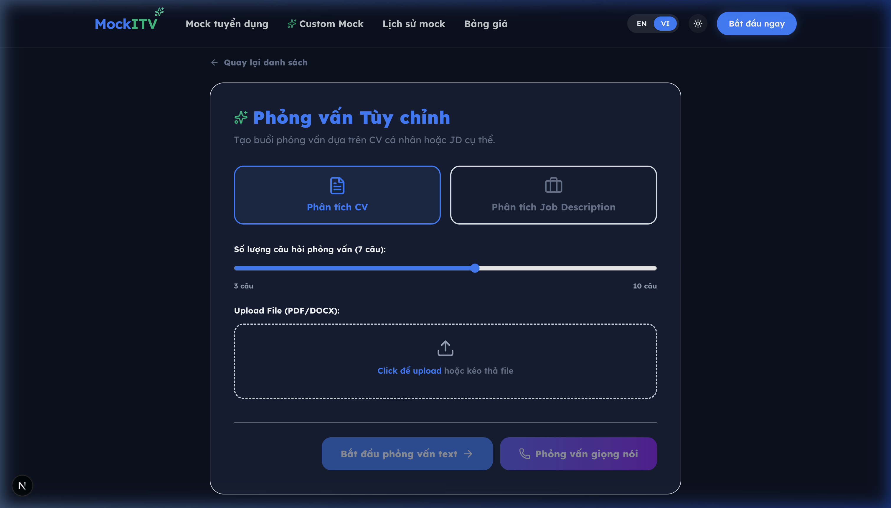
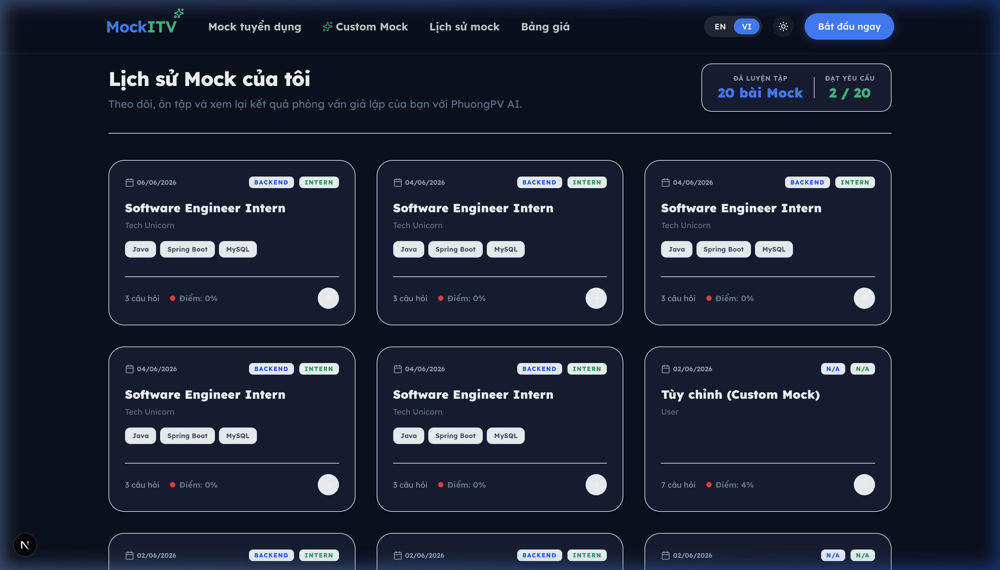

# 🎤 BÀI THUYẾT TRÌNH — MockITV: Nền Tảng Luyện Phỏng Vấn IT với AI

---

## SLIDE 1: YÊU CẦU NGHIỆP VỤ (DOMAIN REQUIREMENTS)

### Bối cảnh vấn đề

**Phỏng vấn kỹ thuật** là một trong những thách thức lớn nhất trong quá trình xin việc của lập trình viên:

- **Chi phí cao:** Một buổi phỏng vấn thử (mock interview) với các chuyên gia có kinh nghiệm (mentors) có thể tốn **100–500 USD/giờ**
- **Thời gian chờ đợi dài:** Phải xếp lịch trước, đợi người cố vấn trả lời, mất nhiều thời gian mới nhận được đánh giá (feedback)
- **Đánh giá không cụ thể:** Hầu hết các nền tảng tự động hiện nay chỉ cho điểm số chung chung, không phân tích chi tiết được từng câu trả lời của ứng viên
- **Khó tiếp cận:** Không phải ai cũng có tiền để thuê chuyên gia riêng hoặc tham gia các khóa luyện phỏng vấn đắt đỏ

### Tại sao chọn MockITV?

✅ **Giải quyết bài toán thực tế:** Ứng dụng trí tuệ nhân tạo (AI) để tự động hóa hoàn toàn quy trình phỏng vấn

✅ **Công nghệ phù hợp:** Các mô hình ngôn ngữ lớn (LLMs) hiện đại (thông qua API tương thích OpenAI) đã hoàn toàn đủ năng lực để:

- Sinh ra bộ câu hỏi bám sát với thực tế yêu cầu công việc
- Đánh giá chi tiết từng câu trả lời (làm nổi bật nguyên văn - verbatim highlighting)
- Cung cấp nhận xét cá nhân hóa cho từng người

✅ **Mô phỏng thực tế:** Hệ thống tự động cân nhắc vị trí (Backend, Frontend, DevOps, AI/ML...), cấp độ (Thực tập sinh → Chuyên gia), và công nghệ cụ thể của ứng viên

✅ **Sức mạnh từ RAG:** Tích hợp cơ sở dữ liệu Vector Pinecone để tạo ra bài phỏng vấn từ chính CV hoặc JD thực tế của ứng viên

✅ **Toàn diện & Dễ tiếp cận:** Bất kỳ ai cũng có thể luyện tập, mọi lúc mọi nơi với chi phí bằng không

---

## SLIDE 2: CÔNG NGHỆ SỬ DỤNG (TECHNOLOGY STACK)

### Ngăn Xếp Công Nghệ Tổng Quan (Tech Stack)

```
┌────────────────────────────────────────────────────┐
│              FRONTEND (Client)                      │
│     Next.js 16 + React 19 + TypeScript              │
│     Tailwind CSS 4 + Framer Motion 12               │
│          (http://localhost:3000)                     │
└──────────────────────┬─────────────────────────────┘
                       ↓
               [Next.js API Rewrite]
                       ↓
┌────────────────────────────────────────────────────┐
│              BACKEND (Máy chủ FastAPI)              │
│     Python 3.10+ + FastAPI + SQLAlchemy              │
│     LangChain + OpenAI SDK (Function Calling)       │
│          (http://localhost:8000)                     │
└──────────────────────┬─────────────────────────────┘
                       ↓
        ┌──────────────┼──────────────┐
        ↓              ↓              ↓
   SQLite DB     LLM API       Pinecone VectorDB
  (WAL mode)   (Function     (text-embedding-3-large
               Calling)        1024 dimensions)
```

### Chi Tiết Công Nghệ

#### FRONTEND

| Công nghệ         | Phiên bản | Mục đích                                        |
| ------------------ | --------- | ----------------------------------------------- |
| **Next.js**        | 16.2.6    | Bộ định tuyến ứng dụng, Kết xuất phía máy chủ (SSR) |
| **React**          | 19.2.4    | Thư viện UI, kiến trúc dựa trên thành phần (component) |
| **TypeScript**     | ^5        | Đảm bảo an toàn kiểu dữ liệu                    |
| **Tailwind CSS**   | ^4        | Framework CSS tiện ích, thiết kế đáp ứng (responsive) |
| **Framer Motion**  | ^12.38.0  | Tạo hoạt ảnh mượt mà, các tương tác vi mô       |
| **next-themes**    | ^0.4.6    | Bộ chuyển đổi giao diện màu Tối/Sáng            |
| **lucide-react**   | ^1.17.0   | Bộ thư viện biểu tượng (Icons)                  |

#### BACKEND

| Công nghệ              | Phiên bản | Mục đích                                        |
| ----------------------- | --------- | ----------------------------------------------- |
| **FastAPI**             | ≥0.115.0  | Framework web bất đồng bộ, tự động xác thực dữ liệu|
| **Uvicorn**             | ≥0.34.0   | Máy chủ ASGI                                    |
| **SQLAlchemy**          | ≥2.0.0    | ORM, bộ xây dựng truy vấn cơ sở dữ liệu         |
| **Pydantic**            | ≥2.0.0    | Xác thực dữ liệu đầu vào/đầu ra                 |
| **LangChain OpenAI**    | ≥0.1.0    | Gọi ChatOpenAI, gán công cụ, bộ mẫu prompt      |
| **LangChain Core**      | ≥0.3.0    | Lõi LangChain chứa cấu trúc cơ sở               |
| **OpenAI SDK**          | ≥1.30.0   | Gọi AI bất đồng bộ (API tương thích OpenAI)     |
| **Pinecone**            | ≥7.0.0    | Cơ sở dữ liệu Vector phục vụ RAG                |
| **LangChain Pinecone**  | ≥0.1.0    | Bộ tích hợp Pinecone với LangChain              |
| **LangChain Splitters** | ≥0.3.0    | Chia nhỏ văn bản đệ quy phục vụ xử lý tài liệu  |
| **Sherpa-ONNX**         | ≥1.10.0   | Dịch giọng nói thành văn bản luồng trực tiếp (offline) |
| **Edge-TTS**            | ≥6.1.0    | Dịch văn bản thành giọng nói (Sử dụng Microsoft Neural) |
| **pypdf + python-docx** | Bản mới  | Đọc trích xuất văn bản từ CV (hỗ trợ PDF/DOCX)  |

#### DATABASE & VECTOR STORE

| Công nghệ      | Mục đích                        |
| --------------- | ------------------------------- |
| **SQLite**      | Chế độ WAL, thiết lập bằng 0, tự động rải dữ liệu mẫu |
| **Pinecone**    | Tìm kiếm Vector Similarity cho luồng RAG |

---

## SLIDE 3: KIẾN TRÚC RAG (RAG DESIGN)

### Luồng RAG — Phỏng Vấn Tùy Chỉnh

MockITV triển khai hệ thống RAG cho tính năng **Phỏng Vấn Tùy Chỉnh**, cho phép ứng viên tải lên CV hoặc Mô tả công việc (Job Description) để tự động tạo ra một bộ câu hỏi phỏng vấn cá nhân hóa sát nhất.

```
┌─────────────────────────────────────────────────────────────────┐
│                    CUSTOM MOCK RAG PIPELINE                      │
└─────────────────────────────────────────────────────────────────┘

[1] Ứng viên tải lên CV/JD (định dạng PDF/DOCX)
         ↓
[2] Backend trích xuất văn bản chữ (bằng pypdf / python-docx)
         ↓
[3] Đưa qua bộ chia văn bản RecursiveCharacterTextSplitter
    ├── Kích thước chunk = 1000
    ├── Độ trùng lặp (overlap) = 100
    └── Bộ chia tách: ["\n\n", "\n", " ", ""]
         ↓
[4] Gọi OpenAI Embeddings (mô hình text-embedding-3-large, 1024 dims)
         ↓
[5] Lập chỉ mục (Index) vào Pinecone VectorDB
    ├── Tên Index: "mockitv"
    └── Vùng tên (Namespace): "session_{session_id}"
         ↓
[6] Gọi trình truy xuất RAG Retriever (lấy top-k = 10)
    └── Bằng câu lệnh (Query): "skills, experience, and requirements"
         ↓
[7] Đưa cho LLM + Function Calling xử lý
    ├── Ngữ cảnh (Context): 10 đoạn thông tin vừa lấy được
    ├── Lời nhắc (Prompt): GENERATE_CUSTOM_QUESTIONS_PROMPT
    └── Công cụ (Tool): generate_interview_questions
         ↓
[8] AI trả về bộ câu hỏi có cấu trúc (Được xác thực định dạng qua Pydantic)
         ↓
[9] Phiên phỏng vấn Mock bắt đầu!
```

### Tại sao cần RAG?

| Không có RAG | Khi có RAG (Pinecone) |
|---|---|
| AI chỉ hỏi được câu hỏi chung chung cho vị trí đó | Câu hỏi được sinh ra **xoáy sâu** vào CV/JD cụ thể |
| LLM không hề biết bối cảnh của ứng viên | LLM nắm rõ toàn bộ ngữ cảnh nhờ tìm kiếm vector |
| Không thể hỏi về các dự án cụ thể mà ứng viên làm | Hỏi chi tiết về từng dự án, kỹ năng ghi trong CV |
| Chỉ dùng 1 lời nhắc prompt = Sinh ra 1 bộ câu hỏi giống nhau cho mọi người | Mỗi CV khác nhau → Hệ thống sẽ sinh ra các câu hỏi hoàn toàn khác nhau |

### Tích hợp Pinecone VectorDB

```python
# ai/pinecone_service.py
embeddings = OpenAIEmbeddings(
    model="text-embedding-3-large",
    dimensions=1024,
)

def index_document(text: str, namespace: str):
    """Chia nhỏ tài liệu và đẩy lên Pinecone."""
    text_splitter = RecursiveCharacterTextSplitter(
        chunk_size=1000,
        chunk_overlap=100,
    )
    docs = text_splitter.create_documents([text])
    vectorstore = get_vectorstore(namespace)
    vectorstore.add_documents(docs)

def get_retriever(namespace: str, k: int = 4):
    """Lấy trình truy xuất để tìm kiếm tương đồng (similarity search)."""
    vectorstore = get_vectorstore(namespace)
    return vectorstore.as_retriever(search_kwargs={"k": k})
```

---

## SLIDE 4: GỌI HÀM (FUNCTION CALLING) — Chi Tiết Kỹ Thuật

### Function Calling là gì?

Function Calling là tính năng cho phép LLM **trả về dữ liệu có cấu trúc** (thường là định dạng JSON) thay vì trả về một đoạn văn bản tự do. Ta khai báo một lược đồ (schema) trước → Mô hình bắt buộc phải trả kết quả đúng với format đó.

**Tại sao lại cần?** — Nếu chỉ dùng cách hoàn thiện văn bản (text completion) thông thường, AI có thể trả về chuỗi JSON bị sai format, thiếu field, hoặc nhồi nhét thêm chữ thừa (ví dụ: "Sure, here is your JSON..."). Function Calling **đảm bảo** đầu ra luôn chuẩn chỉnh 100%.

### Triển khai thông qua bộ decorator `@tool` của LangChain

```python
from langchain_core.tools import tool
from .schemas import QuestionItem

@tool
def generate_interview_questions(questions: list[QuestionItem]) -> str:
    """Công cụ lược đồ để ép AI trả về danh sách câu hỏi."""
    return "ok"

# Cách dùng — Gắn công cụ này vào LLM:
llm = build_llm(cfg).bind_tools(
    [generate_interview_questions],
    tool_choice="generate_interview_questions", # Bắt buộc phải dùng tool này
)
msg = await llm.ainvoke(messages)
args = msg.tool_calls[0]["args"]  # Lấy tham số kiểu Dictionary đã được tự động phân tách
```

### Áp dụng tại 4 nơi trọng yếu trong MockITV:

| Hàm trong mã nguồn | Công cụ Tool tương ứng | Cấu trúc dữ liệu đầu ra |
|---|---|---|
| `generate_questions()` | `generate_interview_questions` | `list[QuestionItem]` |
| `generate_custom_questions()` | `generate_interview_questions` | `list[QuestionItem]` (Có dữ liệu ngữ cảnh RAG) |
| `batch_evaluate_session()` | `evaluate_mock_interview_session` | `EvaluateSessionArgs` (Cấu trúc lồng nhau 3 lớp sâu) |
| `analyze_cv()` | `analyze_candidate_cv` | `AnalyzeCVArgs` |

### Bảng So Sánh: Có vs Không Có Function Calling

| Thuộc tính           | Không dùng Function Calling      | Có dùng Function Calling   |
| -------------------- | -------------------------------- | -------------------------- |
| Định dạng đầu ra     | Văn bản tự do, cần phải lập trình trích xuất | JSON dựa trên lược đồ cố định |
| Độ tin cậy           | AI thường xuyên trả sai format   | Luôn tuân thủ tuyệt đối định dạng |
| Xử lý lỗi hệ thống   | Phải viết try/catch thủ công khi đọc JSON | Tối thiểu — chỉ cần kiểm tra xem có null hay không |
| Dữ liệu có cấu trúc phức tạp| Rất khó để ép AI trả dữ liệu lồng nhau nhiều lớp| Hỗ trợ tính năng gốc (native) cực kì mạnh mẽ |
| Tích hợp Frontend    | Backend phải dọn dẹp (clean) dữ liệu trước | Dữ liệu trả về đẩy thẳng lên giao diện |

---

## SLIDE 5: XỬ LÝ THEO LÔ (BATCHING) — Tối Ưu Tiền Token Lên Tới 80%

### Bài toán: Hệ quả nếu KHÔNG gom lô

Giả sử một phiên phỏng vấn có 7 câu hỏi, nếu ta gọi AI để chấm điểm từng câu một:

```
❌ Cách làm cũ (Cần 7 lần gọi API):
   đánh_giá(Câu 1) → mất 3 giây
   đánh_giá(Câu 2) → mất 3 giây
   ...
   đánh_giá(Câu 7) → mất 3 giây
   ─────────────────
   Tổng thời gian: ~21 giây + Khả năng dính lỗi giới hạn API (rate limit 429) rất cao
```

### Cách gom lô (batch) đột phá của MockITV

```
✅ Cách làm gom lô (Chỉ 1 lần gọi API duy nhất):
   đánh_giá_toàn_phiên([Câu 1, Câu 2, ..., Câu 7]) → mất 5 đến 8 giây
   ─────────────────
   Tổng thời gian: ~6 giây, chỉ dùng đúng 1 yêu cầu gửi đi
```

### Lợi ích nhận được

| Chỉ số (Metric)   | Không Batch (7 lần gọi)          | Có Batch (1 lần gọi duy nhất) |
| ----------------- | -------------------------------- | ---------------------------- |
| Tổng thời gian chờ| ~21s                             | ~6s                          |
| Số lượng API call | 7                                | 1                            |
| Rủi ro nghẽn mạng | Rất cao                          | Rất thấp                     |
| Độ liền mạch mạch văn| Không (Vì bị đánh giá tách biệt) | Có (AI nhìn thấy toàn bộ câu chuyện xuyên suốt từ đầu) |
| Điểm số tổng quát | Hệ thống phải tự ngồi tính toán  | AI sẽ tự chấm tổng thể dựa trên toàn phiên |
| Chi phí tiền token| Phải gửi đi gửi lại câu lệnh (system prompt) dẫn đến lãng phí lớn | Cực kỳ tiết kiệm do chỉ cần gửi ngữ cảnh 1 lần |

### Sức mạnh từ việc Kết Hợp: Batching + Function Calling

```
Đầu vào (Input): Gửi lên 7 câu hỏi + 7 câu trả lời (Trong 1 prompt duy nhất)
     ↓
[Xử lý qua LLM API — Gọi 1 lần duy nhất]
     ↓
Kết quả trả về qua Function Call (Bắt buộc theo chuẩn lược đồ):
{
  "evaluations": [
    {"score": 85, "analysis_chunks": [...], "strengths": [...]},
    ... (Gồm 7 phần tử, được kiểm định từng câu từng chữ)
  ],
  "overall": {
    "overall_score": 78,
    "technical_score": 80,
    "communication_score": 75,
    "feedback_text": "..."
  }
}
```

---

## SLIDE 6: TTS & STT — Phỏng Vấn Giọng Nói (Voice Interview)

### Bài toán đặt ra

- **Dịch giọng nói (STT) theo thời gian thực**: Khi người dùng nói, chữ phải hiện lên **ngay lập tức** (từng từ một) — Không được chờ người dùng nói xong mới hiện
- **Đọc chữ ra tiếng Việt (TTS)**: Giọng AI đọc câu hỏi phải mềm mại, tự nhiên
- **Bảo mật và Tốc độ**: Khâu dịch giọng nói (STT) ưu tiên chạy độc lập hoàn toàn trên máy cục bộ (offline)
- **Độ trễ (Latency)**: Phải ở mức cực thấp < 200ms khi hiện kết quả một phần (partial)

### Tại sao KHÔNG chọn Hugging Face?

| Tiêu chí xem xét   | Hugging Face Whisper     | Sherpa-ONNX (Đã chọn cho dự án) |
| ------------------ | ------------------------ | ------------------------- |
| **Dạng luồng (Streaming)**| ❌ Chỉ làm được theo Batch | ✅ Hỗ trợ Streaming gốc     |
| **Văn bản thời gian thực**| ❌ Không có khi đang nói   | ✅ Chữ hiện ngay khi mở lời |
| **Độ trễ**         | Mất từ 1 đến 3 giây (Gọi API)| Chỉ khoảng ~100ms (Xử lý ngay trên máy) |
| **Hoạt động Offline**| ❌ Bắt buộc phải có mạng   | ✅ Hoàn toàn ngoại tuyến    |
| **Ngốn RAM**       | ~1 đến 4GB               | ~200MB (Mô hình đã được rút gọn int8) |
| **Chi phí**        | Giới hạn cho bản miễn phí| Miễn phí mãi mãi, nhẹ tới mức có thể chạy CPU|

| Tiêu chí xem xét       | Hugging Face TTS         | Edge-TTS (Đã chọn cho dự án)   |
| ---------------------- | ------------------------ | ------------------------------ |
| **Chất lượng Tiếng Việt** | Mức trung bình         | ✅ Cực kỳ xuất sắc (Neural Voices của Microsoft) |
| **Tốc độ đọc**         | Chậm chạp                | ✅ Rất nhanh (~1-2s)            |
| **Chi phí**            | Giới hạn cho bản miễn phí| ✅ Hoàn toàn miễn phí vô hạn    |
| **Thiết lập**          | Quá phức tạp             | ✅ Cài 1 lệnh `pip install edge-tts` |

### Kiến trúc Phỏng Vấn Qua Giọng Nói

```
┌─────────────────────────────────────────────────────────────┐
│                    FRONTEND (Browser)                        │
├─────────────────────────────────────────────────────────────┤
│  [User nói] → Nút Micro → AudioContext + ScriptProcessor    │
│       ↓                                                      │
│  Lấy mảnh dữ liệu PCM float32 (Mỗi mảnh 4096 dòng, mất ~85ms)│
│       ↓                                                      │
│  Đẩy qua WebSocket ws://host:8000/api/voice/ws-stt          │
│       ↓                     ↑                                │
│  [Gửi dạng Nhị phân]    [Nhận về JSON]                       │
│                        {"partial": "luồng tổng quát là..."}  │
│                              ↓                               │
│                     [Hiển thị chữ nổi lên ngay lập tức]       │
│                                                              │
│  [User ngừng nói] → Bắn tín hiệu "END" → Nhận kết quả chốt {"final": "..."} │
│       ↓                                                      │
│  Gửi POST /api/voice/sessions/:id/message-stream (Chuẩn SSE) │
│       ↓                                                      │
│  [Câu trả lời của AI được đổ về theo luồng (streaming) từng câu một] │
│       ↓                                                      │
│  Gọi POST /api/voice/tts {text} → Lấy mã Audio bytes → Phát loa  │
└─────────────────────────────────────────────────────────────┘

┌─────────────────────────────────────────────────────────────┐
│                    BACKEND (Máy chủ FastAPI)                 │
├─────────────────────────────────────────────────────────────┤
│  Kênh WebSocket /api/voice/ws-stt                            │
│  ├── Đón nhận các mảnh PCM từ trình duyệt                    │
│  ├── Nạp vào bộ nhận diện OnlineRecognizer của sherpa-onnx   │
│  ├── Mỗi lần giải mã xong 1 chữ → gửi {"partial": chữ} về    │
│  └── Nhận tín hiệu "END" → Chốt lại toàn bộ → gửi {"final"}  │
│                                                              │
│  Kênh POST /api/voice/tts                                    │
│  ├── Nhận đoạn văn bản → Bỏ vào edge-tts (giọng vi-VN-NamMinh)│
│  └── Trả về mảng byte dữ liệu âm thanh (audio/mpeg)          │
│                                                              │
│  Kênh POST /api/voice/sessions/{id}/message-stream (SSE)     │
│  ├── Gọi LLM astream() → Liên tục nhả ra (yield) các câu văn │
│  └── Đóng gói theo chuẩn SSE: {"type": "sentence", "text": "..."} │
│                                                              │
│  Tài nguyên Sherpa-ONNX Model: streaming-zipformer-multilingual │
│  ├── Lớp mã hóa Encoder: Chuẩn int8 quantized (~50MB)        │
│  ├── Lớp giải mã Decoder: Chuẩn float (~20MB)                │
│  ├── Lớp Joiner: Chuẩn int8 quantized (~10MB)                │
│  └── Cấu hình chi tiết: sample_rate=16000, chunk_size=16, left=128 │
└─────────────────────────────────────────────────────────────┘
```

### Giao Thức WebSocket

```
Browser                          Backend
   |                                |
   |──── [Gửi binary: header+PCM] ─>|  (Cứ mỗi ~85ms)
   |<─── {"partial": "xin"} ────────|
   |──── [Gửi binary: header+PCM] ─>|
   |<─── {"partial": "xin chào"} ───|
   |──── [Gửi binary: header+PCM] ─>|
   |<─── {"partial": "xin chào các bạn"} ─|
   |                                |
   |──── [Gửi lệnh text: "END"] ───>|  (Người dùng bấm dừng)
   |<─── {"final": "xin chào các bạn"} ───|
   |                                |
   |──── [Đóng cổng kết nối socket] ─|
```

---

## SLIDE 7: CÁC TÍNH NĂNG CHI TIẾT CỐT LÕI

### 7.1. Phỏng vấn Mock theo đặc tả công việc

Người dùng chọn một chức danh (ví dụ: "Lập trình viên Backend cấp độ Senior"), hệ thống lập tức tự sinh một bộ câu hỏi đánh thẳng vào cấp độ khó và công nghệ đi kèm của chức danh đó.

```
Người dùng chọn công việc → POST /api/sessions → AI sinh ngay câu hỏi (qua Function Calling)
→ Người dùng thực hiện trả lời → POST /api/sessions/:id/answer
→ Gọi POST /api/sessions/:id/evaluate → AI chấm điểm lô toàn bộ → Xuất kết quả
```

### 7.2. Đánh giá Bôi Màu Từng Chữ (Verbatim Highlighting)

Sau khi hoàn tất phỏng vấn, AI sẽ săm soi và bóc tách từng phần trong câu trả lời của người dùng:

- 🟢 **Màu Xanh (success):** Phần trả lời đúng, giải thích thỏa đáng, đủ chi tiết
- 🟡 **Màu Vàng (warning):** Phần này trả lời còn hời hợt, chưa nắm rõ bản chất
- 🔴 **Màu Đỏ (danger):** Phát ngôn sai lệch kiến thức, thiếu hụt trầm trọng

Mỗi cụm bôi màu sẽ có riêng một bảng tooltips (popup) chi tiết lý do vì sao.

**Bảo vệ toàn vẹn (Verbatim validation):** Backend tự động dùng thuật toán để quét xem các đoạn bôi màu mà AI nhả ra có khớp 100% với nguyên văn câu trả lời gốc của ứng viên hay không. Khớp thì mới cho qua, nếu AI sửa văn của ứng viên → Bắt AI làm lại tự động.

### 7.3. Phỏng vấn Bằng Giọng Nói (Voice Interview)

Cho phép người dùng nói chuyện hai chiều như thật với người phỏng vấn ảo. Kết hợp Sherpa-ONNX streaming STT + Giọng đọc tiếng Việt Edge-TTS + Trả lời văn bản luồng SSE.

### 7.4. Phân Tích CV & Cá Nhân Hóa (CV Analysis & Personalization)

Chỉ cần ném CV định dạng PDF/DOCX lên → AI đọc lướt, gom lấy thông tin kỹ năng, các dự án nổi bật, phát hiện ra những điểm mù → Tạo ra câu hỏi "vặn vẹo" chính cái CV đó.

### 7.5. Phỏng vấn Tùy Chỉnh Siêu Phàm Nhờ RAG (Custom Mock)

Ngoài CV, nếu người dùng có một bản Mô tả công việc (JD), ném vào hệ thống → Index lên kho dữ liệu Vector Pinecone → Áp dụng RAG để lôi các đoạn JD liên quan nhất nhét vào đầu LLM → LLM đẻ ra câu hỏi sát rạt với công ty người dùng đang ứng tuyển.

### 7.6. Bảng Theo Dõi Lịch Sử (History Tracking)

Bảng điều khiển lưu lại dấu ấn các bài phỏng vấn, biểu diễn thành 4 tiêu chí cốt lõi bằng đồ thị tròn: Tổng thể, Kỹ thuật chuyên môn, Kỹ năng giao tiếp, Kỹ năng giải quyết vấn đề. Đưa ra hướng đi cần cải thiện ở cuối bài.

### 7.7. Kho Lưu Trữ Việc Làm (Mock Jobs Database)

Có sẵn 7 vị trí từ thực tập sinh đến kiến trúc sư, cover từ Frontend, Backend đến DevOps, bám sát các tech stack hot nhất hiện tại ngoài thị trường.

---

## SLIDE 8: KIẾN TRÚC BACKEND CHI TIẾT TRONG SUỐT

### Kiến Trúc Dịch Vụ AI (Sử dụng LangChain)

```
Gói thư mục ai/ (Gồm 7 file chia để trị)
├── config.py      → Nắm giữ cấu hình AIConfig + nạp cấu hình (load_config)
├── schemas.py     → Chứa các mô hình Pydantic (QuestionItem, AnalysisChunk, ...)
├── prompts.py     → 6 file Mẫu Kịch Bản (ChatPromptTemplate) cố định
├── chains.py      → Bộ xây dựng LLM, chiến lược thử lại (retry logic), phân tách tham số
├── validators.py  → File chịu trách nhiệm kiểm tra ngữ pháp Verbatim
├── service.py     → Chứa 8 hàm nghiệp vụ đứng ra điều phối (orchestration)
└── pinecone_service.py → Trình giao tiếp với VectorDB Pinecone (Nạp, Lọc)
```

### 8 Hàm AI Chuyên Biệt

| # | Tên Hàm | Mục đích | Có dùng Tool Không? |
|---|---|---|---|
| 1 | `generate_questions()` | Sinh câu hỏi cơ bản | ✅ Qua Function Calling |
| 2 | `generate_custom_questions()` | Sinh câu hỏi móc từ RAG | ✅ Qua Function Calling |
| 3 | `batch_evaluate_session()` | Đánh giá tổng một phiên | ✅ Qua Function Calling |
| 4 | `analyze_cv()` | Lướt đọc CV ứng viên | ✅ Qua Function Calling |
| 5 | `voice_interview_respond()` | Phản xạ khi trò chuyện | ❌ Để văn tự do |
| 6 | `voice_interview_respond_stream()` | Phản xạ dạng trả về luồng | ❌ Dạng luồng (SSE) |
| 7 | `text_to_speech()` | Chuyển văn sang giọng tiếng Việt | — |
| 8 | `index_document()` | Nạp tài liệu lên Pinecone | — |

### Chiến Lược Khôi Phục (Retry & Fallback Strategy)

- **Khi API dính Rate limit (429):** Tự động ngưng một lúc theo cấp số nhân rồi mới gọi lại, tối đa 5 lần
- **Khi dính Verbatim violation:** Tự động mắng AI trả sai nguyên văn, bắt làm lại, tối đa 2 lần
- **Khi sập toàn bộ (Complete failure):** Cho mặc định mọi điểm là 50 + Nhả ra câu thông báo lỗi hệ thống
- **Khi lỗi đọc giọng (TTS failure):** Bắn request lại 3 lần, mỗi lần cách nhau 0.5s

---

## SLIDE 9: TỐI ƯU HÓA & THỰC HÀNH TỐT NHẤT

### Tối Ưu Token: Đánh giá theo lô (Batch Evaluation)

- Gửi lên 7 câu trả lời × gọi 1 lần = tốn khoảng ~6 giây thay vì phải gọi 7 lần × mỗi lần 3 giây = ~21 giây
- Lượng token được cứu sống: Cắt giảm ~80% (Do không phải nhai lại cái ngữ cảnh system prompt cho từng câu hỏi)

### Đẩy Toàn Bộ Lên Bất Đồng Bộ (Async/Await Throughout)

```python
# Toàn bộ khâu giao tiếp với AI đều được đẩy vào Async, tuyệt đối không gây nghẽn I/O
async def generate_questions(...):
    msg = await llm.ainvoke(messages)
    ...
```

### Cơ Chế Bảo Vệ Việc Bôi Màu Chữ

```python
def validate_verbatim_chunks(user_answer, chunks):
    expected = re.sub(r'\s+', ' ', user_answer.strip())
    actual = re.sub(r'\s+', ' ', join_chunk_text(chunks).strip())
    if actual != expected:
        raise VerbatimChunksError(...)  # → Sai 1 phát là vứt, bắt AI tự làm lại
```

### Phương Án Chữa Cháy Cho Frontend

```typescript
// Nếu backend vẫn không ép được AI nhả ra định dạng màu mè chuẩn, đành hiện câu trả lời nguyên bản (fallback)
if (evaluation.analysisChunks?.length > 0) {
  renderHighlightedChunks(evaluation.analysisChunks);
} else {
  renderRawAnswer(evaluation);
}
```

---

## SLIDE 10: VẤN ĐỀ GẶP PHẢI & HƯỚNG GIẢI QUYẾT

### Vấn đề 1: JSON do LLM nhả ra bị vỡ cấu trúc

**Nguyên nhân:** Đôi khi AI vui tính bọc đống JSON trong cú pháp markdown (```json...)
**Giải pháp:** Bọc cứng bằng bộ trang trí LangChain `@tool` + dùng `bind_tools()` + ép cứng `tool_choice` → Chắc chắn Function Calling phải thực thi.

### Vấn đề 2: Dính lỗi sai nguyên văn (Verbatim Mismatch)

**Nguyên nhân:** AI quá tự tin, tự sửa bớt mấy từ ngu ngơ trong câu trả lời của ứng viên khi nhả mảng `analysis_chunks`.
**Giải pháp:** Viết hàm `validate_verbatim_chunks()` tự động soi rọi xem có chữ nào bị thiếu không, nếu có gọi đè prompt bắt AI sửa lỗi ngay lập tức.

### Vấn đề 3: Phông chữ bị cắt lẹm ở màn hình thẻ bài

**Nguyên nhân:** Dùng font Lexend + Đặt chiều cao cứng cho thẻ bài → Chữ tiêu đề dài bị nuốt.
**Giải pháp:** Nới lỏng thẻ bằng `min-h-[240px]` kết hợp `leading-normal py-1`.

### Vấn đề 4: Giọng nói (STT) bị đơ lúc mới bật

**Nguyên nhân:** Mỗi lần bật micro, mô hình của Sherpa-ONNX mất tận 2s để đưa từ ổ cứng lên RAM.
**Giải pháp:** Dùng mẫu thiết kế Singleton (Singleton lazy-load pattern) — Nạp mô hình một lần duy nhất lúc máy chủ mới dậy.

### Vấn đề 5: Rớt mạng khi gọi chuyển giọng nói TTS

**Nguyên nhân:** Kết nối WebSocket với Edge-TTS chập chờn.
**Giải pháp:** Cho vòng lặp retry 3 lần, nghỉ nhịp 0.5s ở trong hàm `text_to_speech()`.

---

## SLIDE 11: ĐÁNH GIÁ KIỂM THỬ (TEST EVALUATION)

### Phương Pháp Kiểm Thử
- **Kiểm thử Đơn vị & Tích hợp (Unit & Integration Testing):** Sử dụng `pytest` kết hợp `FastAPI TestClient`.
- **Môi trường Database Độc lập:** Mỗi lần chạy test sẽ tạo một cơ sở dữ liệu riêng biệt để không ảnh hưởng dữ liệu thật.
- **Làm giả dữ liệu (Mocking) AI Services:** Làm giả (Mock) toàn bộ các lệnh gọi ra OpenAI API và Pinecone, đảm bảo test chạy ổn định, cực nhanh và không phát sinh phí API.

### Các Kịch Bản Test (Test Cases) Đạt 100% (7/7 Pass)
1. **Kiểm tra trạng thái (Health Check):** Đảm bảo API Backend luôn phản hồi mã 200 OK.
2. **Lấy danh sách công việc (Job Listing):** Trả về đúng dữ liệu, đúng schema JSON cấu trúc.
3. **Mở phiên phỏng vấn mới (Create Session):** AI mock trả về đủ 7 câu hỏi đúng định dạng.
4. **Nộp câu trả lời (Submit Answer):** Backend ghi nhận lại câu trả lời chính xác, cập nhật vào bảng dữ liệu chờ AI đánh giá.
5. **Chấm điểm theo lô (Batch Evaluate):** AI mock chấm điểm tổng quát, cập nhật các tiêu chí đánh giá thành phần và kiểm tra mảng nguyên văn bôi màu (verbatim chunks).
6. **Đọc và Phân tích CV (CV Analysis):** Mock quá trình đọc tệp dữ liệu giả, trích xuất điểm mạnh/yếu.
7. **Phỏng vấn tùy chỉnh RAG (Custom Mock RAG):** Test luồng nạp tệp (PDF/DOCX), sinh phiên mock cá nhân hóa và bắt buộc trả đúng JSON có khóa định dạng camelCase chuẩn.

### Bài học kinh nghiệm từ quá trình Test
- Việc đồng nhất định dạng khóa (keys) (camelCase ở API vs snake_case ở cơ sở dữ liệu) là cực kỳ quan trọng, nếu không test sẽ thất bại lập tức do lỗi Pydantic.
- Mocking các dịch vụ gọi ra LLM giúp quá trình tích hợp liên tục (CI/CD) trong tương lai có thể hoạt động mượt mà hơn.

---

## SLIDE 12: GIAO DIỆN SẢN PHẨM (INTERFACE SCREENSHOTS)

Dưới đây là các giao diện chính yếu của MockITV (MVP):

**1. Landing Page (Trang Chủ)**  
Trang chủ giới thiệu tổng quan với thiết kế Hero Section hiện đại, hiệu ứng gradient mờ.


**2. Danh Sách Công Việc (Job Listings)**  
Màn hình tìm kiếm và thẻ công việc có hỗ trợ bộ lọc trực quan theo Cấp độ và Danh mục.


**3. Chi Tiết Vị Trí (Job Details)**  
Màn hình chi tiết trước khi phỏng vấn, hiển thị thông tin tech stack và số vòng.


**4. Phỏng Vấn Tùy Chỉnh (Custom Mock)**  
Giao diện tải lên CV để tạo phiên phỏng vấn cá nhân hóa nhờ RAG VectorDB.


**5. Lịch Sử & Đánh Giá (History & Evaluation)**  
Giao diện phân tích đa chiều bằng SVG RadialProgress và Verbatim Highlighting.


---

## SLIDE 13: HƯỚNG DẪN TRIỂN KHAI (DEPLOYMENT INSTRUCTIONS)

### Kiến Trúc Hiện Tại (Môi trường Dev)

```
Chạy trên 1 máy duy nhất (Single Machine):
├── Lớp Frontend (Dựng bằng Next.js, chạy port 3000)
├── Lớp Backend (Dựng bằng FastAPI, chạy port 8000)
├── Database (Dùng tạm SQLite, ghi vào mockitv.db)
└── Kho Vector (Lưu trên dịch vụ đám mây Pinecone)
```

### Khởi Động Nhanh (Zero-Config)

```bash
# Đối với máy macOS/Linux
chmod +x start.sh && ./start.sh

# Đối với máy Windows
start.bat
```

Hệ thống sẽ tự: Dựng môi trường ảo venv → Tải pip install → Tải npm install → Kéo 2 máy chủ lên → Mở sẵn trình duyệt để demo.

### Mở Rộng Trong Tương Lai (Bản Production)

```
Kiến trúc cấp độ thực tế doanh nghiệp:
├── Lớp Frontend: Quăng lên Vercel/Netlify để ăn CDN
├── Lớp Backend: Đẩy lên AWS EC2 (kèm auto-scaling theo tải)
├── Database: Đổi sang PostgreSQL (Dùng dạng managed cloud)
├── Lớp Cache: Kẹp thêm Redis (Để lưu đệm các câu hỏi/phiên nháp)
├── Lưu file: Đưa CV ứng viên lên AWS S3
├── Kho Vector: Pinecone (Sẵn có trên cloud rồi)
└── Lớp AI: Chỉ định riêng Endpoint giá rẻ (Cost optimization)
```

---

## SLIDE 14: KẾT LUẬN

### Thành tựu chính mang lại

✅ **Dựng thành công hệ thống Phỏng vấn Mock sử dụng trí tuệ nhân tạo toàn diện** — Tự đẻ câu hỏi, đánh giá bôi màu từng chữ cực ngầu, trò chuyện qua Voice như người, cá nhân hóa CV, và dùng RAG mở rộng kiến thức.

✅ **Cập nhật nhanh công nghệ thời thượng** — Next.js 16 + React 19, FastAPI xử lý đa luồng, dùng LangChain làm nhạc trưởng điều khiển AI, kéo Pinecone VectorDB.

✅ **Bắt Trend RAG** — Cho Pinecone VectorDB kết đôi với bộ nhúng text-embedding-3-large để xử đẹp việc trích xuất văn bản từ CV/JD.

✅ **Tối ưu kinh tế (Cost optimization)** — Cứu được 80% tiền token nhờ nhét vào lô đánh giá, các tác vụ nặng đưa vào nền (async), dịch giọng nói kéo về xử tại máy (offline STT).

✅ **Xài mẫu thiết kế chuẩn thực tế (Production-ready patterns)** — Bắt lỗi mượt mà, phòng bị fallback chu đáo, thiết lập retry hợp lý, khóa kiểu an toàn (TypeScript + Pydantic), chặn lỗi chế lời (verbatim validation).

### Hướng tiến hóa tiếp theo

1. **Phân tích nét mặt (Face Analysis):** Mở camera lên → Đo độ tự tin qua mắt, xem ứng viên có liếc tài liệu hay không
2. **Lộ trình cá nhân hóa (Learning Paths):** Đo lường sau 10 bài test → Nhét tài liệu bắt học chỗ còn hổng
3. **Đưa lên nền tảng Mobile:** Viết lại một cái App bằng React Native
4. **Mở phòng tập thể (Team Features):** Cho phép nhóm luyện chung, có bảng xếp hạng Leaderboards
5. **Xuất báo cáo PDF (Export Reports):** In báo cáo xịn xò sau khi xong phiên

### Ý Nghĩa Kinh Tế (Impact & Business Value)

- Đưa chi phí thuê mentor từ $500/buổi → Trở về $0 tròn trĩnh
- Chỉ cần thích là luyện tập, không phụ thuộc vào giờ giấc của ai
- Đóng vai trò là một dự án Showcase hoàn hảo hội tụ đủ: Full-stack + AI + RAG + Hệ thống giọng nói Voice.

---

## BẢNG TỔNG TẮT NHANH

| Khía cạnh (Aspect)  | Thông tin chi tiết (Chi tiết)                                                              |
| ------------------- | --------------------------------------------------------------------- |
| **Tên dự án**       | MockITV — AI-Powered Mock Interview Platform                          |
| **Lý do chọn**      | Cứu vớt túi tiền cho sinh viên & Mang lại phản hồi siêu chi tiết mà Mentor thật cũng lười làm  |
| **Công nghệ lõi**   | Next.js 16, React 19, FastAPI, LangChain, Pinecone, SQLite            |
| **Hệ thống RAG**    | Kết hợp Pinecone VectorDB + text-embedding-3-large (hỗ trợ tới 1024 dims)                |
| **Tính năng đỉnh**  | Phỏng vấn tự sinh, Bôi màu lỗi sai, Luyện qua Giọng nói, Xào nấu CV, và RAG CV/JD |
| **Giao tiếp AI**    | Bọc lệnh Function Calling + Gom lô chấm điểm (Batch) + Trang trí hàm `@tool`  |
| **Tối ưu hóa**      | Tiết kiệm 80% tiền token, xử lý bất đồng bộ, dùng STT chạy ngầm máy, tải mô hình 1 lần  |
| **Triển khai**      | Viết sẵn kịch bản chạy 1 click, dễ dàng đưa lên môi trường mây (cloud)  |

---

**Nhóm:** Nhóm 2 — Lớp AIA06  
**Cập nhật lần cuối:** Tháng 6 / 2026  
