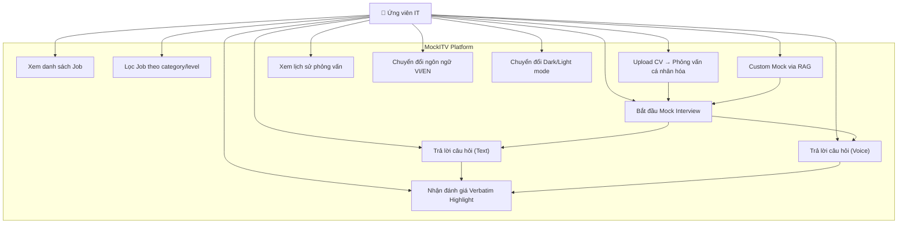

# MockITV — User Stories & Use Case Documentation

## 1. Personas

### Persona 1: Ứng viên IT (Primary User)

- **Tên mẫu:** Minh — Junior Backend Developer
- **Bối cảnh:** Đang chuẩn bị phỏng vấn cho vị trí Backend tại công ty công nghệ lớn
- **Pain points:** Chi phí mock interview cao, không có feedback chi tiết, thiếu cơ hội luyện tập
- **Mục tiêu:** Luyện tập phỏng vấn kỹ thuật miễn phí, nhận feedback cụ thể từng câu trả lời

### Persona 2: Sinh viên IT (Secondary User)

- **Tên mẫu:** Lan — Sinh viên năm cuối CNTT
- **Bối cảnh:** Chưa có kinh nghiệm phỏng vấn thực tế, muốn chuẩn bị cho kỳ thực tập
- **Pain points:** Không biết mình yếu ở đâu, không có mentor
- **Mục tiêu:** Hiểu được cấu trúc phỏng vấn IT, biết điểm mạnh/yếu

---

## 2. User Stories

### Epic 1: Mock Interview theo vị trí công việc

| ID | User Story | Priority | Trạng thái |
|---|---|---|---|
| US-01 | Là ứng viên, tôi muốn xem danh sách các vị trí công việc mock, để chọn vị trí phù hợp với mục tiêu của mình. | Must-have | ✅ Đã triển khai |
| US-02 | Là ứng viên, tôi muốn lọc công việc theo category (Backend, Frontend, DevOps...) và level (Intern, Junior, Senior...), để nhanh chóng tìm vị trí phù hợp. | Must-have | ✅ Đã triển khai |
| US-03 | Là ứng viên, tôi muốn xem chi tiết vị trí công việc (tech stack, rounds, yêu cầu), để quyết định có bắt đầu phỏng vấn hay không. | Must-have | ✅ Đã triển khai |
| US-04 | Là ứng viên, tôi muốn bắt đầu phỏng vấn mock và nhận câu hỏi được AI sinh tự động theo vị trí/level/tech stack, để luyện tập sát thực tế. | Must-have | ✅ Đã triển khai |
| US-05 | Là ứng viên, tôi muốn trả lời từng câu hỏi phỏng vấn bằng text, để mô phỏng phỏng vấn thực tế. | Must-have | ✅ Đã triển khai |
| US-06 | Là ứng viên, tôi muốn thấy đồng hồ bấm giờ khi phỏng vấn, để biết mình đang dùng bao lâu. | Should-have | ✅ Đã triển khai |

### Epic 2: Đánh giá chi tiết (Verbatim Highlighting)

| ID | Câu chuyện người dùng (User Story) | Độ ưu tiên | Trạng thái |
|---|---|---|---|
| US-07 | Là ứng viên, tôi muốn nhận đánh giá chi tiết cho **từng câu hỏi** với điểm số riêng, để biết mình mạnh/yếu ở đâu. | Must-have | ✅ Đã triển khai |
| US-08 | Là ứng viên, tôi muốn thấy câu trả lời của mình được **highlight màu** (xanh/vàng/đỏ) cho từng cụm từ, để biết chính xác phần nào đúng, phần nào cần cải thiện. | Must-have | ✅ Đã triển khai |
| US-09 | Là ứng viên, tôi muốn click vào phần được highlight để xem **popup giải thích chi tiết**, để hiểu vì sao đúng/sai. | Should-have | ✅ Đã triển khai |
| US-10 | Là ứng viên, tôi muốn nhận **điểm tổng** (Overall, Technical, Communication, Problem Solving), để có cái nhìn toàn diện. | Must-have | ✅ Đã triển khai |
| US-11 | Là ứng viên, tôi muốn nhận danh sách **strengths, weaknesses, recommendations, topics to learn, resources**, để biết cần ôn gì tiếp. | Should-have | ✅ Đã triển khai |

### Epic 3: Voice Interview

| ID | Câu chuyện người dùng (User Story) | Độ ưu tiên | Trạng thái |
|---|---|---|---|
| US-12 | Là ứng viên, tôi muốn **trả lời câu hỏi bằng giọng nói**, để mô phỏng phỏng vấn qua voice call thực tế. | Should-have | ✅ Đã triển khai |
| US-13 | Là ứng viên, tôi muốn **nghe AI đọc câu hỏi** bằng giọng Việt tự nhiên, để trải nghiệm giống phỏng vấn thật. | Should-have | ✅ Đã triển khai |
| US-14 | Là ứng viên, tôi muốn thấy **real-time transcript** khi đang nói, để biết hệ thống đang nhận diện gì. | Should-have | ✅ Đã triển khai |
| US-15 | Là ứng viên, tôi muốn AI phỏng vấn viên **phản hồi conversational** (nhận xét + hỏi tiếp), để trải nghiệm giống hội thoại thực. | Should-have | ✅ Đã triển khai |

### Epic 4: CV Analysis & Personalization

| ID | Câu chuyện người dùng (User Story) | Độ ưu tiên | Trạng thái |
|---|---|---|---|
| US-16 | Là ứng viên, tôi muốn **upload CV** (PDF/DOCX) để nhận phân tích, biết mình phù hợp vị trí nào. | Should-have | ✅ Đã triển khai |
| US-17 | Là ứng viên, tôi muốn nhận **câu hỏi phỏng vấn cá nhân hóa** dựa trên CV, để luyện tập sát với profile thực. | Should-have | ✅ Đã triển khai |

### Epic 5: Custom Mock via RAG (Pinecone)

| ID | Câu chuyện người dùng (User Story) | Độ ưu tiên | Trạng thái |
|---|---|---|---|
| US-18 | Là ứng viên, tôi muốn **upload CV hoặc Job Description** để tạo bộ phỏng vấn hoàn toàn tùy chỉnh, để luyện tập cho vị trí cụ thể mình đang apply. | Must-have | ✅ Đã triển khai |
| US-19 | Là ứng viên, tôi muốn hệ thống sử dụng **RAG (Pinecone VectorDB)** để trích xuất thông tin từ tài liệu và sinh câu hỏi xoáy sâu vào nội dung. | Must-have | ✅ Đã triển khai |

### Epic 6: History & Tracking

| ID | Câu chuyện người dùng (User Story) | Độ ưu tiên | Trạng thái |
|---|---|---|---|
| US-20 | Là ứng viên, tôi muốn xem **lịch sử** tất cả các buổi phỏng vấn đã làm, để theo dõi tiến độ. | Must-have | ✅ Đã triển khai |
| US-21 | Là ứng viên, tôi muốn xem **chi tiết kết quả** từng buổi phỏng vấn (điểm, highlight, feedback), để ôn lại. | Must-have | ✅ Đã triển khai |

### Epic 7: UX & Accessibility

| ID | Câu chuyện người dùng (User Story) | Độ ưu tiên | Trạng thái |
|---|---|---|---|
| US-22 | Là ứng viên, tôi muốn chuyển đổi **Dark/Light mode**, để phù hợp với sở thích cá nhân. | Nice-to-have | ✅ Đã triển khai |
| US-23 | Là ứng viên, tôi muốn sử dụng giao diện bằng **Tiếng Việt hoặc Tiếng Anh**, để tiện sử dụng. | Nice-to-have | ✅ Đã triển khai |
| US-24 | Là ứng viên, tôi muốn giao diện **responsive** trên mobile/tablet, để sử dụng trên mọi thiết bị. | Should-have | ✅ Đã triển khai |

---

## 3. Use Case Diagram

---

## 4. Use Case Flows

### UC-01: Mock Interview Flow (Text Mode)

| Bước | Người dùng (Actor) | Hành động (Action) | Phản hồi hệ thống (System Response) |
|---|---|---|---|
| 1 | User | Mở trang Mocks | Hiển thị grid các vị trí công việc |
| 2 | User | Lọc theo category/level | Grid cập nhật theo filter |
| 3 | User | Click chọn 1 job | Hiển thị chi tiết job (tech stack, rounds) |
| 4 | User | Click "Bắt đầu phỏng vấn" | POST /api/sessions → AI sinh câu hỏi → Chuyển sang interview view |
| 5 | User | Gõ câu trả lời cho câu 1 | Hiển thị character counter, timer đếm |
| 6 | User | Click "Tiếp theo" | POST /api/sessions/:id/answer → Chuyển sang câu tiếp |
| 7 | User | Trả lời hết tất cả câu | Hiển thị nút "Kết thúc & Đánh giá" |
| 8 | User | Click "Kết thúc & Đánh giá" | POST /api/sessions/:id/evaluate → AI batch evaluate → Redirect /history |
| 9 | User | Xem kết quả | 4 RadialProgress charts + Verbatim highlights + Recommendations |

### UC-02: Voice Interview Flow

| Bước | Người dùng (Actor) | Hành động (Action) | Phản hồi hệ thống (System Response) |
|---|---|---|---|
| 1 | User | Click "Phỏng vấn giọng nói" | POST /api/sessions → Tạo session + TTS đọc câu hỏi đầu |
| 2 | User | Nghe AI đọc câu hỏi | Audio phát qua speaker |
| 3 | User | Nhấn mic, bắt đầu nói | WebSocket mở → Streaming STT → Real-time transcript |
| 4 | User | Nhấn dừng mic | Send "END" → nhận final text |
| 5 | System | — | POST /api/voice/sessions/:id/message-stream → AI phản hồi (SSE) → TTS đọc |
| 6 | User | Nghe AI phản hồi | Chat bubble hiển thị, audio phát |
| 7 | — | Lặp bước 3-6 | — |
| 8 | User | Click "Kết thúc" | POST /api/sessions/:id/evaluate → Redirect /history |

### UC-03: Custom Mock via RAG

| Bước | Người dùng (Actor) | Hành động (Action) | Phản hồi hệ thống (System Response) |
|---|---|---|---|
| 1 | User | Mở trang Custom Mock | Hiển thị upload form |
| 2 | User | Upload CV hoặc JD (PDF/DOCX) | Parse text → Index vào Pinecone VectorDB |
| 3 | User | Chọn số câu hỏi, bấm tạo | RAG retrieve → AI sinh câu hỏi → Tạo session |
| 4 | User | Trả lời câu hỏi | Tiếp tục như UC-01 từ bước 5 |

---

## 5. Yêu Cầu Phi Chức Năng (Non-Functional Requirements)

| Yêu cầu | Mô tả | Trạng thái |
|---|---|---|
| **Performance** | AI response < 10s, STT latency < 200ms | ✅ Đạt |
| **Reliability** | Retry logic cho API 429, fallback cho AI failures | ✅ Đạt |
| **Usability** | Responsive design, dark/light mode, i18n VI/EN | ✅ Đạt |
| **Security** | No auth required (workshop scope) | ⚠️ Ngoài phạm vi |
| **Scalability** | SQLite dev → PostgreSQL prod path ready | ✅ Đã thiết kế |
